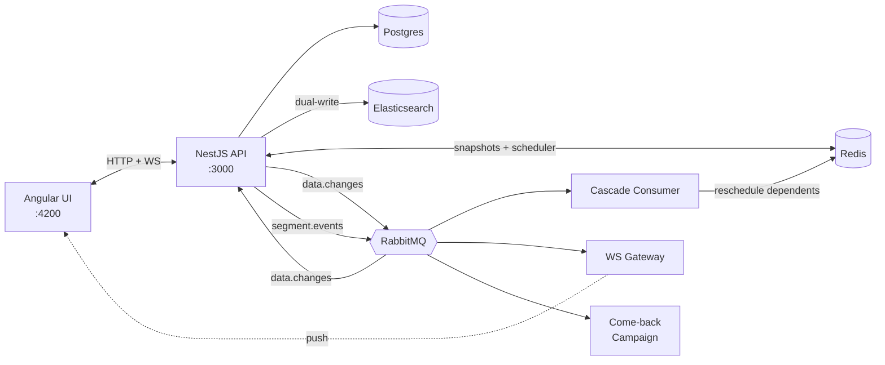
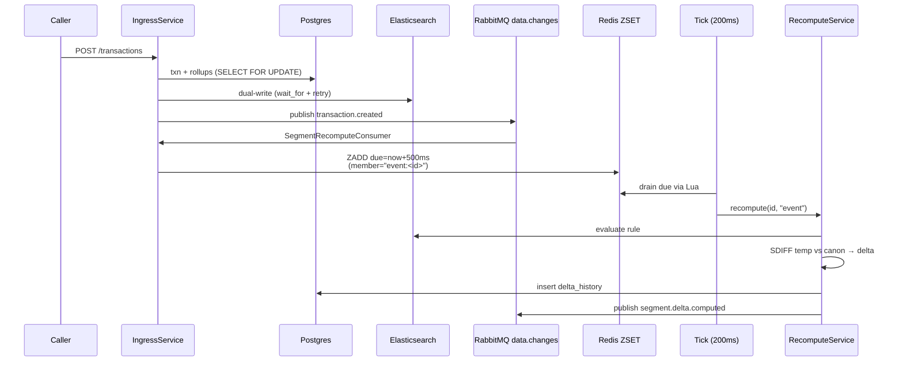
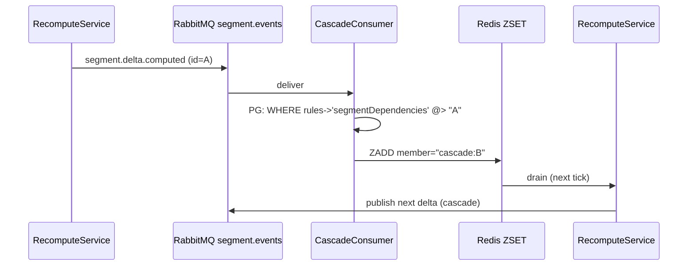

# Optio Segments

A customer-segmentation engine: rules-based dynamic and static segments, real-time delta computation (who joined / who left), and propagation of those deltas to downstream consumers — UI, cascading dependent segments, and a sample background process.

---

## Setup

**Prerequisites:** Docker + Docker Compose. That's it.

```bash
docker compose up
```

This boots Postgres 16, Redis 7, RabbitMQ 3.13, Elasticsearch 8, the NestJS API (port 3000), and the Angular UI (port 4200). Healthchecks gate startup so the API only starts once its dependencies are ready.

The API container's startup command runs migrations and the seed automatically:

```
npm run migration:run && npm run seed && npm run start:dev
```

The seed creates **500 clients**, transactions across the past ~140 days, and **5 segments** (4 dynamic + 1 static, including one cascade segment).

To re-seed manually after experimentation:

```bash
docker compose exec api npm run seed
```

Once running:

- UI: <http://localhost:4200>
- API: <http://localhost:3000>
- RabbitMQ console: <http://localhost:15672> (login `optio` / `optio`)

A guided demo script is in [`DEMO_GUIDE.md`](./DEMO_GUIDE.md).

---

## The task in one paragraph

Build a system where customer segments — groups of clients matching filter rules — stay in sync with changing data automatically, but report changes as **explicit deltas** (who specifically was added, who specifically was removed) rather than just "did it change." Dynamic segments must update on data changes; static segments must stay frozen until a manual refresh. A segment can use another segment as a filter, so changes must cascade. Bursts of changes (500 events / minute, 50K-client bulk imports) must be coalesced and chunked rather than producing a per-change signal storm. The deltas must reach at least two consumer types with full delta information.

---

## Seeded segments

| ID                  | Type    | Rule                                                                 |
| ------------------- | ------- | -------------------------------------------------------------------- |
| `recent-buyers`     | dynamic | last transaction in last 14 days                                     |
| `high-spenders`     | dynamic | total purchases in last 60 days > 1200                               |
| `lapsed-customers`  | dynamic | ≥3 transactions ever AND last transaction >24 days ago               |
| `lapsed-high-value` | dynamic | members of `high-spenders` ∩ members of `lapsed-customers` (cascade) |
| `georgian-cohort`   | static  | country = 'GE', frozen at seed time                                  |

---

## Stack and why

| Component         | Why                                                                                                                                           |
| ----------------- | --------------------------------------------------------------------------------------------------------------------------------------------- |
| **Postgres**      | Source of truth (clients, transactions, segment definitions, delta history).                                                                  |
| **Elasticsearch** | Segment rules are AND/OR/NOT filter trees → ES `bool` query DSL is the same shape. New segments require no backend code.                      |
| **Redis**         | SETs for membership snapshots (SDIFF for delta computation), ZSET as the debounced recompute scheduler.                                       |
| **RabbitMQ**      | Two exchanges decouple input events (`data.changes`) from output events (`segment.events`); multiple consumers attach via independent queues. |
| **NestJS**        | DI, modules, decorators for `@RabbitSubscribe` / `@WebSocketGateway` / `@Interval`.                                                           |
| **Angular**       | Optio's own stack; not a place to invent yak-shaves.                                                                                          |

---

## Architecture



Two exchanges by lifecycle:

- **`data.changes`** — input: transactions, client edits, bulk imports.
- **`segment.events`** — output: a delta was computed.

Three consumers attach to `segment.events` independently — `cascade.q`, `ui.push.q`, `come-back-campaign.q`.

### New transaction flow



### Cascade



---

## Architectural decisions and trade-offs

### Elasticsearch (not Postgres) for segment evaluation

Segment rules are JSON filter trees; ES's `bool` DSL is the same shape and the cascade case (`terms` filter on a 30K-ID member set) is what ES is built for. Postgres would mean dynamic SQL with `WHERE id IN (...30K UUIDs...)` — works, doesn't scale. **Cost:** dual-write complexity (`refresh: wait_for` + version-conflict retry). In production, CDC (Debezium → Kafka → ES) replaces application-level dual-writes.

### Trailing-edge debounce with max-age cap

Dynamic segments need to recompute on data change, but a 500-events-per-minute stream shouldn't fire 500 recomputes.

| Option                                   | Behavior                                        | Why not                                       |
| ---------------------------------------- | ----------------------------------------------- | --------------------------------------------- |
| **Throttle** (fire ≤1× per N)            | bounded throughput                              | trailing-edge stale until next window         |
| **Buffer** (collect for N, flush)        | same shape as throttle                          | same problem                                  |
| **Leading-edge / SET-NX-EX**             | fire first event, drop the rest                 | drops, doesn't coalesce — wrong shape         |
| **Trailing debounce + max-age (chosen)** | wait for quiet, then process; force-drain at 5s | sub-second on quiet streams + starvation-safe |

Implementation: ZSET keyed on `${reason}:${segmentId}`. Each `ZADD` upserts the score forward. A parallel hash records first-scheduled time per member, and the schedule Lua script computes `dueAt = min(now + 500ms, firstAt + 5000ms)` so the entry can't be deferred past 5s. The drain Lua atomically pops the ZSET and clears the hash.

**Why ZSET over RabbitMQ delayed-message exchange:** Rabbit's delayed plugin doesn't dedup — 500 events publish 500 deferred messages. ZSET upserts dedup on the member by construction.

### Atomic snapshot swap via RENAME

Recompute builds the new membership in `segment:members:<id>:temp`, computes deltas via `SDIFF` against the canonical key, then atomically `RENAME temp canonical`. The alternative — `DEL` + `SADD` — has a window where the canonical set is empty and concurrent readers see incorrect state.

### Two exchanges, not one

`data.changes` (input) and `segment.events` (output) are separate exchanges _by lifecycle_. Three consumers (cascade, WebSocket gateway, come-back campaign) each bind their own queue to `segment.events`. A single-exchange design would have worked too at the cost of routing-key namespacing fragility.

### Reason-tagged scheduling (`event` vs `cascade` vs `manual`)

Every recompute records _why_ it ran. The reason is encoded directly into the ZSET member as `${reason}:${segmentId}` — atomic by construction, no parallel hash needed. `manual` bypasses the scheduler entirely (manual recompute on a static segment fires immediately, the user wants no debounce there). Audit trails in `delta_history` and the WebSocket push payload include the reason.

### Static segments: filter at the consumer, not in the recompute service

`SegmentRecomputeConsumer` filters its segment query to `type = 'dynamic'`. That's the _whole_ mechanism — static segments are simply never scheduled by data events. The recompute service itself is type-agnostic, which is why `POST /segments/:id/recompute` works on both types.

### Bulk path: chunked + debounced

`POST /clients/bulk` chunks at 1000 per chunk (multi-row INSERT + ES `_bulk` + one event per chunk). Intermediate chunks use `refresh: false`; only the last uses `wait_for` to avoid serializing on ES refresh cycles. **50K writes → 50 events → 4 recomputes** thanks to the debouncer. `POST /simulate/fast-forward` shifts `occured_at` backward and flows through the same path.

### Destructive fast-forward over clock injection

Two ways to simulate time: mutate `transactions.occured_at` backward (destructive but _honest_ — every query, including ES `now-14d/d`, sees the shifted timestamps) or thread a `Clock` abstraction through every layer. The latter would require rewriting ES `now-Xd/d` literals into absolute timestamps at evaluation time, which is doable but easy to miss a branch. Chose destructive; documented; `npm run seed` resets state.

---

## Extras built beyond the brief

- **Come-back campaign consumer** (the optional bonus). Subscribes to `segment.events`, reacts to removals from `recent-buyers`, persists a "send" record. Counter visible at the bottom of the segment list page.
- **UI:**
  - Real-time WebSocket push with green/red flash animations on add/remove.
  - Per-row "Add transaction" and "Edit client" modals.
  - Delta history panel with reason-color-coded badges (`event` teal, `cascade` purple, `manual` amber) and a drill-down that hydrates the actual added/removed clients.
  - Simulation bar (fast-forward days, bulk-import N clients).
- **Three reason codes** in `delta_history` so every change is traceable to its trigger.
- **Max-age starvation protection** on the debouncer — a sustained constant-rate stream cannot defer a recompute past 5 seconds.

---

## Future improvements

- Topological sort of segment dependency graph (matters at multi-level cascades).
- Replace dual-write with CDC (Debezium → Kafka → ES).
- Transactional outbox for Rabbit publishes.
- AuthN / AuthZ / rate limits on simulation endpoints.

---

## AI usage

Used Claude (Opus 4.x) heavily for trade-off analysis, boilerplate (controllers, DTOs, Angular plumbing), and documentation. Architectural decisions are mine; happy to defend any of them.
