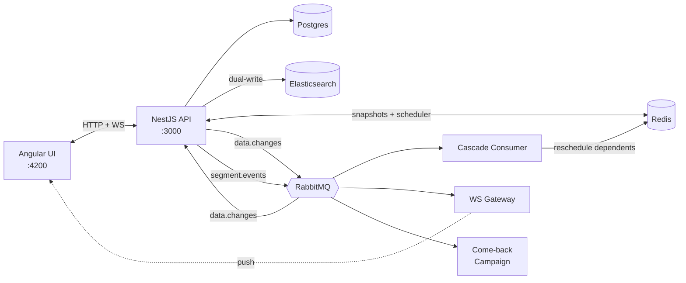
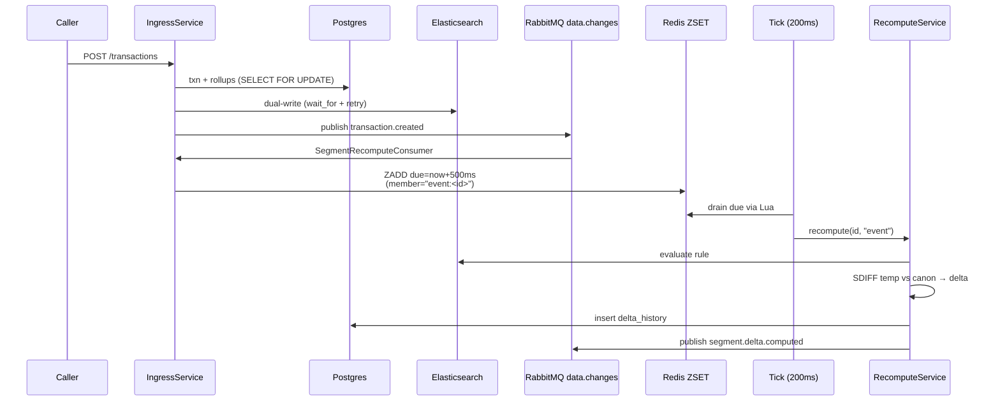
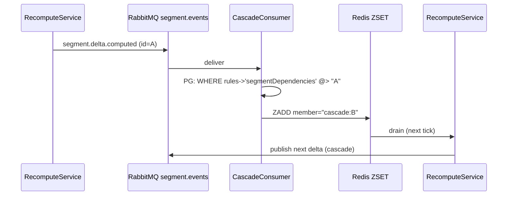

# Optio Segments

System that divides existing customers into predefined segments, and displays this to the ui. The segment memberships are updated in real-time as client info changes/they get added transactions. Segment updates emit events, upon which marketing campaigns can be built (client X entered segment Y, send them a "Welcome" message).

---

## Setup

**Prerequisites:** Docker + Docker Compose.

```bash
docker compose up
```

This boots Postgres 16, Redis 7, RabbitMQ 3.13, Elasticsearch 8, the NestJS API (port 3000), and the Angular UI (port 4200). Healthchecks gate startup so the API only starts once its dependencies are ready.

The API container's startup command runs migrations and the seed automatically:

```
npm run migration:run && npm run seed && npm run start:dev
```

The seed creates **500 clients**, transactions across the past ~140 days, and **5 segments** (4 dynamic + 1 static, including one cascade segment).

To re-seed manually after experimentation:

```bash
docker compose exec api npm run seed
```

Once running:

- UI: <http://localhost:4200>
- API: <http://localhost:3000>
- RabbitMQ console: <http://localhost:15672> (login `optio` / `optio`)

---

## Seeded segments

| ID                  | Type    | Rule                                                                 |
| ------------------- | ------- | -------------------------------------------------------------------- |
| `recent-buyers`     | dynamic | last transaction in last 14 days                                     |
| `high-spenders`     | dynamic | total purchases in last 60 days > 1200                               |
| `lapsed-customers`  | dynamic | ≥3 transactions ever AND last transaction >24 days ago               |
| `lapsed-high-value` | dynamic | members of `high-spenders` ∩ members of `lapsed-customers` (cascade) |
| `georgian-cohort`   | static  | country = 'GE', frozen at seed time                                  |

---

## Architecture



Two exchanges by lifecycle:

- **`data.changes`** — input: transactions, client edits, bulk imports.
- **`segment.events`** — output: a delta was computed.

Three consumers attach to `segment.events` independently — `cascade.q`, `ui.push.q`, `come-back-campaign.q`.

### New transaction flow



### Cascade



---

## Architectural decisions and trade-offs

### Elasticsearch (not Postgres) for segment evaluation

We currently store clients data both in ES and PG, as well as rollups to determine certain segment memberships (total_purchases_60d). but we do the querying in ES. This decision was made because of the speed of ES, the tradeoff of duplicate writes was considered acceptable.

**Note on dependant segments**

The segment that depends on other segments (`lapsed-high-value`, depends on `high-value` and `lapsed-customers`), is being recalculated only using the IDs stored in redis, i decided for splitting the evaluation path into two branches (ES for normal dynamic branches, finding the common IDs of `high-value` and `lapsed-customers` in Redis for the composite segment) to get the speed benefit.

### Trailing-edge debounce with max-age cap

Dynamic segments need to recompute on data change, but a 500-events-per-minute stream shouldn't fire 500 recomputes.

Implementation: ZSET keyed on `${reason}:${segmentId}`. Each `ZADD` upserts the score forward. A parallel hash records first-scheduled time per member, and the schedule Lua script computes `dueAt = min(now + 500ms, firstAt + 5000ms)` so the entry can't be deferred past 5s. The drain Lua atomically pops the ZSET and clears the hash.

**Why Trailing-edge and not Leading-edge**

Trailing-edge debounce so the recompute reflects the latest state after a burst (leading-edge / throttle would lock in the first event's snapshot and silently drop later changes). Capped by a 5s max-age so a never-quiet stream can't postpone a recompute forever.

### Membership Delta computation via redis

Recomputation of segment memberships via Redis `SDIFF`. We store the IDs of previous and current members - do a two way diff (temp -> canonical, canonical -> temp) to compute the delta. after recompute, `temp` becomes `canonical`.

### Two exchanges, not one

`data.changes` (input) and `segment.events` (output) are separate exchanges _by lifecycle_. Three consumers (cascade, WebSocket gateway, come-back campaign) each bind their own queue to `segment.events`. Could have done with only one exchange, but thought that input-output separation would be cleaner than namespacing the events into inputs and outputs.

### Static segments: filter at the consumer, not in the recompute service

`SegmentRecomputeConsumer` filters its segment query to `type = 'dynamic'`. That's the _whole_ mechanism — static segments are simply never scheduled by data events. The recompute service itself is type-agnostic, which is why `POST /segments/:id/recompute` works on both types.

### Destructive fast-forward over clock injection

Currently fast-forward is achieved by changing the dates of the transaction records by X days. Could have implemented a dynamic clock service (code would reference the dynamic clock instead of Date.now()), but could not fit into scope, would lead to difficulties (ES date filtering in particular).

### AI usage

Used Claude (Opus 4.x) heavily for trade-off analysis, boilerplate (controllers, DTOs, Angular plumbing), and documentation. Architectural decisions are mine; happy to defend any of them.
